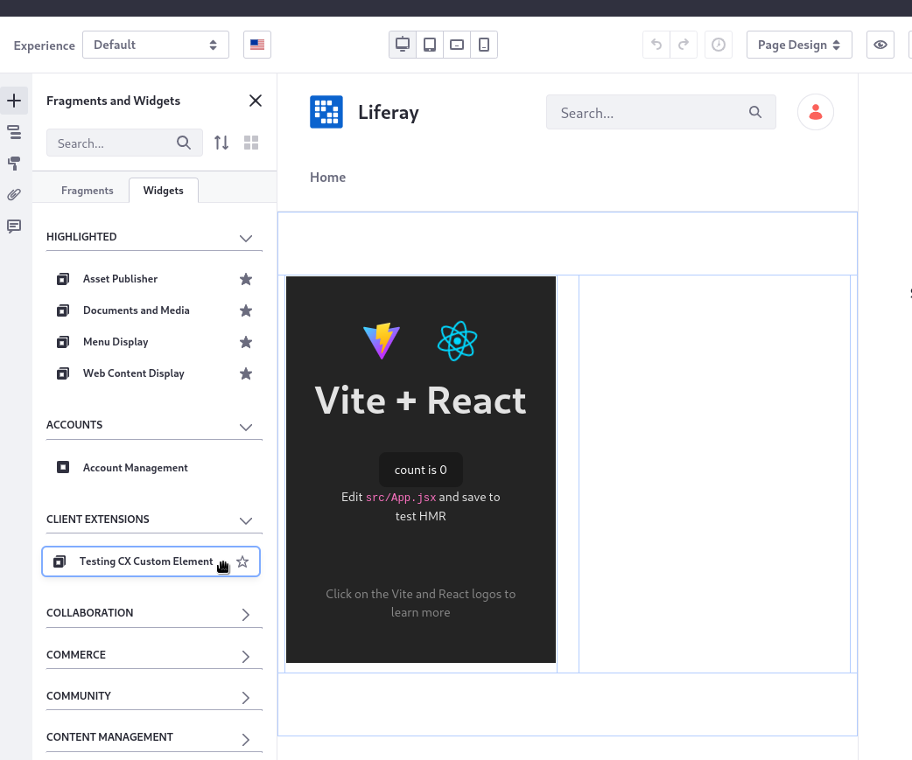

## Liferay CX: Importmap + Custom Element

What was done:

- A `customElement` CX was created with Vite, as [`ES Module`](https://developer.mozilla.org/en-US/docs/Web/JavaScript/Guide/Modules) (`useESM: true`):

  - Both `react` and `react-dom` were specified as `external` dependencies (check [`vite.config.js`](./client-extensions/testing-cx-custom-element/vite.config.js) for mor details), so they will not be included in the final app bundle file.

- The `feature.flag.LPS-172903` was active to allow creating `jsImportMapsEntry` CX;

- Two `jsImportMapsEntry` CX were created, [as configuration](https://liferay.dev/blogs/-/blogs/-front-end-client-extension-how-to-automate-deployments-for-remote-apps-in-on-premises), to map `react` and `react-dom` module resolution:

  - Check [`react`](./configs/common/osgi/configs/com.liferay.client.extension.type.configuration.CETConfiguration_react-es-importmap.config)
  - Check [`react-dom`](./configs/common/osgi/configs/com.liferay.client.extension.type.configuration.CETConfiguration_react-dom-es-importmap.config)

---

### How to run this project

1. Clone it and enter into the project's directory;

1. Run `blade server init`;

1. Run `blade server run` or `blade server start`;

1. After the Liferay instance shows up in the browser, run `blade gw deploy` to deploy the extension

1. Use the custom element inside a page:

